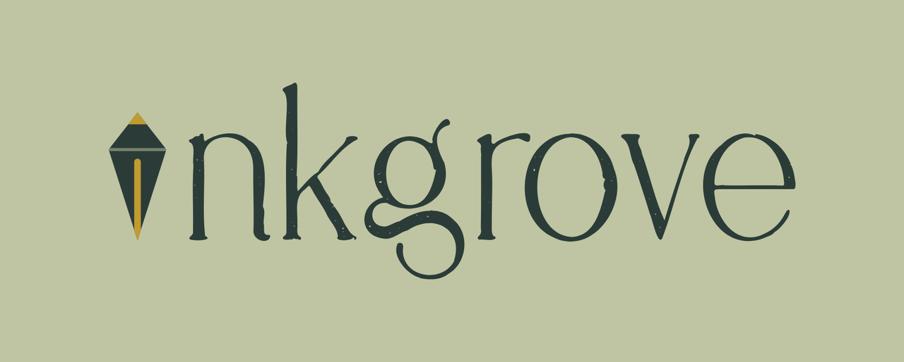

<div align="center">



### Write your novel. It stays yours.

A complete, **local-first** writing studio for long-form fiction — as a free desktop app.
No account. No upload. No server. Your words live on your machine.

[**⬇ Download the latest release**](https://github.com/capactiyvirus/inkgrove/releases/latest) &nbsp;·&nbsp; [Try the browser demo](https://lit-haven.pages.dev)

</div>

> **This repository hosts the public releases of Inkgrove.** The application source is
> maintained privately; grab the installer from [Releases](https://github.com/capactiyvirus/inkgrove/releases/latest).

---

## Download & install

| Platform | Status | Asset |
|---|---|---|
| **Windows 10/11 (x64)** | ✅ Available | `Inkgrove_<version>_x64-setup.exe` (recommended) or `Inkgrove_<version>_x64_en-US.msi` |
| **macOS** | 🔜 Coming soon | — |
| **Linux** | 🔜 Coming soon | — |
| **iOS / Android** | 🔜 Planned | — |

No installer for your OS yet? Use the free **browser demo** — no install, runs entirely
in your browser: **https://lit-haven.pages.dev**

### Windows: "Windows protected your PC"
Inkgrove is in **alpha** and not yet code-signed, so Windows SmartScreen may flag it as
from an *unrecognized publisher*. This is expected for a new app, not a virus warning —
click **More info → Run anyway**. Code signing is on the roadmap.

After installing, launch **Inkgrove** from the Start menu. On first run it shows a short
welcome, then drops you into your projects.

---

## What it is

Inkgrove is a full novel-writing environment — not a note-taking app with a word count.
Everything a long manuscript needs, in one place:

- **📝 Distraction-free editor** — a clean, paginated writing surface with focus mode.
- **📑 Chapter binder** — organize your manuscript into chapters and scenes, drag to reorder.
- **🗂️ Corkboard** — see your scenes as index cards; rearrange the structure visually.
- **🧭 Outline** — a bird's-eye view of the whole book, with per-scene synopses.
- **📖 Story Bible** — track **characters**, **world** details, and **research** in one place,
  linked to where they appear.
- **🧩 Plot grid** — map plot threads across chapters so nothing gets dropped.
- **🔍 Project-wide search** — find any line across the entire manuscript instantly.
- **🕘 Scene snapshots** — automatic versions of your scenes, so an edit is never final.
- **🎯 Writing goals** — set a manuscript word target and a daily goal; a streak keeps
  you honest.
- **📥 Import your work** — drop in a folder of `.docx` / `.md` / `.txt` and Inkgrove
  sorts it into chapters (and can extract characters, world, and plot for you).

---

## Local-first & private

Your writing **never leaves your machine** unless you choose to move it.

- **On disk, in your control** — the desktop app stores your work as a real database
  file on your computer (`inkgrove.db`), not in a cloud you don't own.
- **No account, no sign-up, no telemetry of your text.** There is no server to send it to.
- **Fully offline.** Write on a plane; nothing depends on a connection.
- **Automatic backups** — the app keeps rolling local backups so a bad edit, crash, or
  corruption is recoverable.

### Where your data lives (Windows)
```
Your library:   %LOCALAPPDATA%\app.inkgrove.desktop\inkgrove.db
Backups:        %LOCALAPPDATA%\app.inkgrove.desktop\backups\
Settings:       %APPDATA%\app.inkgrove.desktop\config.json
```
These survive app updates. To move Inkgrove to a new machine, copy `inkgrove.db`.

---

## Your own AI (bring your own key)

Inkgrove has a **manuscript-aware AI** that you power with **your own Anthropic API key** —
so you pay the AI provider directly and **we never see your key or your writing**.

- Paste your key in **⚙ Settings** (session-only by default) and pick a model
  (Claude Haiku / Sonnet / Opus).
- **Scene & book synopsis** — summarize what you've written.
- **Build from manuscript** — the AI reads your draft and *proposes* characters, world
  entries, and plot threads for you to review and apply.
- An **AI history** log shows what ran and the token spend.

**The principle:** AI **assists** — it reads, summarizes, and organizes. It **never writes
your prose for you**. The book stays yours.

---

## Cross-device, your way

No proprietary sync. If you want your manuscript on more than one machine, point Inkgrove's
files at a folder inside **your own Dropbox / iCloud / Google Drive** — your cloud carries
it across devices. Your data, your account, no middleman.

---

## Status

**Alpha.** Inkgrove is under active development and improving fast.

- Back up your work (the app's Export, plus your own cloud folder) so a cleared install or
  disk failure can't cost you the novel.
- Expect rough edges; please [report issues](https://github.com/capactiyvirus/inkgrove/issues).

---

## On the roadmap

- macOS & Linux desktop builds
- Native mobile apps
- **Story Map** — see your whole book at a glance
- Import from Scrivener and more
- Code-signed installers

---

<div align="center">

**[Download](https://github.com/capactiyvirus/inkgrove/releases/latest)** ·
**[Browser demo](https://lit-haven.pages.dev)** ·
**[Report an issue](https://github.com/capactiyvirus/inkgrove/issues)**

*Inkgrove — a writing tool that assists, and never writes your prose for you.*

</div>
